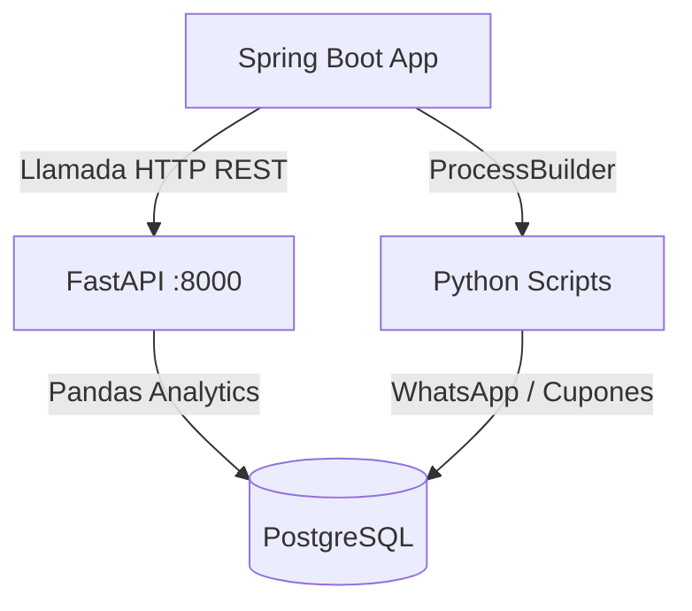

# Lavadero Car Wash - Sistema Híbrido de Gestión y Ventas

Este proyecto es una solución híbrida de nivel enterprise diseñada para un **Lavadero de Autos Completo (Car Wash)**. Combina **Java (Spring Boot)** en el backend principal por su robustez, tipado fuerte y manejo de transacciones, junto con **Python** para automatizaciones de marketing digital, segmentación de datos con Pandas y envíos automatizados (WhatsApp / Mailing).

---

## 📸 Mockup de Interfaz Propuesta (UI/UX)

Para brindar una experiencia premium, proponemos un diseño moderno con colores oscuros (Dark Mode), acentos en violeta eléctrico (`#7C3AED`) y azul neon.


### Características de la UI/UX:
1. **Dashboard Consolidado:** Métricas clave del día (facturación, servicios en curso, caja diaria y alertas de bajo stock).
2. **Calendario de Turnos Interactivo:** Visualización tipo *timeline* de los lavaderos en progreso (Lavado simple, completo, de motor, tapizados, encerado) clasificados por color según su estado (Pendiente, En Progreso, Completado).
3. **Punto de Venta Rápido (POS):** Atajos rápidos para vender productos del lavadero (ceras, aromatizantes, microfibras, siliconas) y facturar con un solo clic.

---

## 1. Arquitectura del Proyecto

El sistema se organiza bajo una estructura de **Monorepo** que unifica la base de datos, el backend Java y los servicios de automatización de Python.

### Estructura de Directorios

```text
lavadero-monorepo/
├── database/                       # Base de datos relacional
│   └── schema.sql                  # Creación de tablas, índices y datos semilla
├── backend-java/                   # Servidor principal Java (Spring Boot 3.x)
│   ├── pom.xml                     # Dependencias Maven
│   └── src/main/
│       ├── java/com/lavadero/
│       │   ├── controller/         # Endpoints REST (Caja, POS, Turnos, Marketing)
│       │   ├── service/            # Lógica e integración con scripts de Python
│       │   └── LavaderoApplication.java # Clase principal
│       └── resources/
│           └── application.yml     # Configuración y credenciales de conexión
├── automation-python/              # Scripts de automatización y marketing
│   ├── requirements.txt            # Dependencias Python
│   ├── api/
│   │   └── main.py                 # FastAPI microservicio para análisis de segmentación
│   └── scripts/
│       ├── customer_loyalty.py     # Script de fidelización (Inactivos > 20 días)
│       └── whatsapp_sender.py      # Script de automatización de envío de WhatsApp
└── README.md                       # Documentación del sistema
```

### Flujo de Integración Híbrida

El backend Java se integra con los componentes Python a través de dos mecanismos estratégicos:



1. **Llamadas REST Síncronas (FastAPI):** Usado para procesos de respuesta inmediata que involucran manipulación de datos en memoria (ej. consultar la segmentación de clientes calculada por Pandas).
2. **Ejecución Asíncrona / CLI (ProcessBuilder):** Usado para disparar tareas en segundo plano que ejecutan herramientas locales (ej. scripts que simulan interacciones de interfaz mediante PyAutoGUI o Selenium para mandar recordatorios de turnos por WhatsApp).

---

## 2. Descripción de Módulos

### MÓDULO 1: Arquitectura Híbrida (Conectividad)
* **Java (Spring Boot):** Expone APIs REST, gestiona el Punto de Venta (POS), controla el stock y la caja diaria de forma segura con JPA/Hibernate.
* **Integración Java-Python:** El servicio `PythonIntegrationService.java` ejecuta comandos del sistema operativo localizando el entorno de Python configurado (`python.executable`) y capturando los flujos de salida (`stdout` y `stderr`) en tiempo de ejecución.
* **Base de Datos Unificada (PostgreSQL):** Almacena de forma centralizada todas las entidades comerciales y de fidelización, permitiendo a Python leer y procesar datos transaccionales de forma nativa.

### MÓDULO 2: Ventas, Facturación y Caja (Java)
* **Registro de Servicios:** Soporte para lavados segmentados con duración estimada para control de tiempos de entrega y asignación de empleados.
* **Punto de Venta (POS) y Stock:** Registro de ventas de productos físicos de retail del lavadero. Incluye validación de stock y alertas automáticas cuando un artículo está por debajo del `stock_minimo`.
* **Caja Diaria:** Control del flujo de caja diaria (monto apertura, egresos por compras, ingresos por ventas/servicios, y balance de cierre).

### MÓDULO 3: Publicidad, WhatsApp y Fidelización (Python)
* **Envío Programado por WhatsApp (`whatsapp_sender.py`):** Automatiza el contacto con el cliente al agendar un turno o al finalizar el lavado. Utiliza la API de WhatsApp Web y simula el envío físico mediante control de teclado con `pyautogui`.
* **Script de Fidelización de Clientes (`customer_loyalty.py`):**
  * Busca clientes cuya última visita fue hace más de 20 días.
  * Genera automáticamente un cupón del 15% de descuento (`VOLVEXXXXXX`) que expira en 15 días.
  * Registra el cupón en la base de datos para que el POS Java pueda validarlo al momento de la facturación.
* **Segmentación de Clientes (`api/main.py`):** Endpoint `/segmentacion` que recupera las transacciones históricas de los clientes, y mediante **Pandas** los agrupa en:
  * **VIP:** Clientes con gasto acumulado > $30,000 ARS o más de 10 visitas.
  * **FRECUENTE:** Clientes con gasto entre $10,000 y $30,000 ARS, o de 4 a 10 visitas.
  * **OCASIONAL:** Clientes con consumos menores a los anteriores.

---

## 3. Guía de Ejecución y Despliegue

### Paso 1: Configurar la Base de Datos
1. Instale y asegúrese de que su servidor PostgreSQL esté corriendo.
2. Cree una base de datos llamada `lavadero`.
3. Ejecute el script `database/schema.sql` para crear las tablas e insertar los datos iniciales de prueba:
   ```bash
   psql -U postgres -d lavadero -f database/schema.sql
   ```

### Paso 2: Configurar el Entorno Python
1. Diríjase a la carpeta `automation-python`:
   ```bash
   cd automation-python
   ```
2. Cree e instale el entorno virtual (`venv`):
   ```bash
   python -m venv .venv
   # En Windows para activar:
   .venv\Scripts\activate
   # Instalar dependencias:
   pip install -r requirements.txt
   ```
3. Ejecute el microservicio FastAPI:
   ```bash
   python api/main.py
   ```
   *(Estará disponible en http://localhost:8000)*

### Paso 3: Configurar y Ejecutar Java Spring Boot
1. Abra el proyecto `backend-java` en su IDE preferido (IntelliJ, Eclipse, VS Code).
2. Si su base de datos PostgreSQL tiene credenciales distintas a `postgres/postgres`, modifique las variables de entorno o edite el archivo [application.yml](file:///c:/Lavadero/backend-java/src/main/resources/application.yml).
3. Asegúrese de configurar la variable `PYTHON_EXECUTABLE` con la ruta de su entorno virtual de Python para que la ejecución con ProcessBuilder resuelva correctamente las dependencias instaladas.
4. Compile y ejecute el backend:
   ```bash
   mvn clean spring-boot:run
   ```
   *(Estará disponible en http://localhost:8080)*

### Paso 4: Probar los Endpoints de Integración
* **Ejecutar Campaña de Fidelización (Java ejecutando Python):**
  Haga un POST a `http://localhost:8080/api/marketing/run-loyalty`.
  *Esto invocará en segundo plano `customer_loyalty.py`, generando cupones de descuento en la DB para clientes inactivos.*
* **Enviar Mensaje de WhatsApp Automatizado:**
  Haga un POST a `http://localhost:8080/api/marketing/send-whatsapp?telefono=+5491122334455&mensaje=Tu auto está listo!`
* **Obtener Segmentación de Clientes (FastAPI procesado con Pandas):**
  Haga un GET a `http://localhost:8080/api/marketing/segmentacion` o directo a `http://localhost:8000/segmentacion`.
