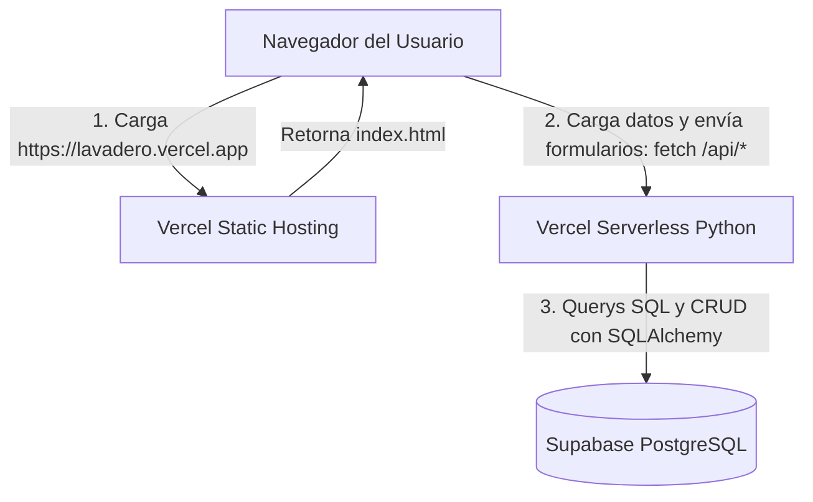

# Plan de Implementación: Despliegue de la UI Completa en Vercel (Front-end Estático + API Serverless)

Dado que **Vercel** es una plataforma orientada a frontend y microservicios serverless (y no puede ejecutar instancias persistentes de Java/Spring Boot), convertiremos la interfaz del lavadero en una **Single-Page Application (SPA)** estática. 

La página se servirá directamente por Vercel en la raíz (`/`) y llamará asíncronamente a los endpoints de la base de datos Supabase a través del microservicio de Python (FastAPI) mapeado en `/api/`.

---

## 1. Arquitectura de Despliegue del Sistema en Vercel

### A. Frontend Cliente (index.html en la Raíz)
Reescribiremos la plantilla `dashboard.html` como un archivo estático `index.html` en la raíz de tu repositorio:
* Reemplazaremos las directivas del motor Thymeleaf de Java (`th:text`, `th:each`, `th:if`) por renderizado en el cliente usando JavaScript nativo (`fetch()` y plantillas dinámicas `innerHTML`).
* Al cargar la página, se llamará a `/api/dashboard-data` para recibir y renderizar toda la información comercial al instante.

### B. Mapeo de APIs en Python FastAPI
Extenderemos el backend de Python en `automation-python/api/main.py` para añadir soporte a las operaciones del dashboard, conectando directo a Supabase:
* `GET /api/dashboard-data`: Obtiene todos los turnos, productos, servicios, empleados, estado de caja, NPS y alertas.
* `POST /api/caja/abrir` y `POST /api/caja/cerrar`: Control de caja diaria.
* `POST /api/turnos/agendar` y `POST /api/turnos/{id}/estado`: Gestión de la agenda de lavados.
* `POST /api/pos/venta` y `POST /api/pos/productos/{id}/reabastecer`: Punto de venta e insumos.
* `POST /api/empleados/nuevo` y `POST /api/empleados/{id}/estado`: Administración del personal.

---

## Proposed Changes

### [Componente: Servidor de Analítica y APIs (Python)]
*Ampliación del backend FastAPI para soportar las operaciones del POS, caja y turnos.*

#### [MODIFY] [main.py](file:///c:/Lavadero/automation-python/api/main.py)
- Agregar endpoints REST en FastAPI para responder a todas las acciones de la interfaz (caja, ventas, empleados, turnos, feedback).
- Implementar el consolidador de datos `/api/dashboard-data` consultando Supabase.

---

### [Componente: Frontend de Vercel (HTML/JS)]
*Construcción de la interfaz SPA.*

#### [NEW] [index.html](file:///c:/Lavadero/index.html)
- Reemplazo de Thymeleaf por llamadas AJAX síncronas/asíncronas al API serverless de Vercel.
- Renderizado de componentes UI en caliente (Timeline de Turnos, POS de Productos, Equipo de Trabajo, Alertas de Stock, widget NPS).

#### [MODIFY] [vercel.json](file:///c:/Lavadero/vercel.json)
- Configurar `rewrites` para que Vercel sirva el archivo `index.html` estático en el frontend y dirija las peticiones `/api/*` al motor serverless Python.

---

## 2. Plan de Verificación y Lanzamiento

1. **Prueba en Local:** Ejecutar localmente FastAPI y cargar `index.html` para validar que responda y renderice las tarjetas correctamente.
2. **Push a GitHub:** Ejecutar `git push` para desplegar las actualizaciones en Vercel.
3. **Verificación en Producción:** Abrir la URL pública de Vercel en el navegador y probar el flujo completo (registrar lavado, cobro POS, valoración NPS, alternar empleados).
