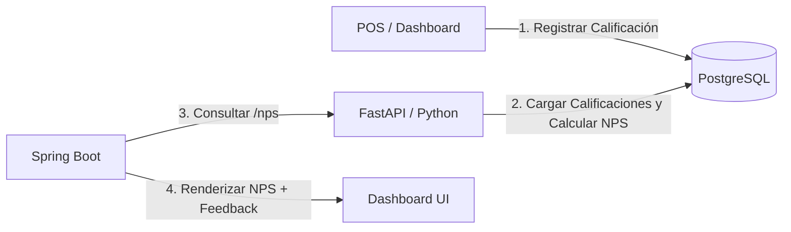

# Plan de Implementación: Módulo de Satisfacción de Clientes y NPS (Net Promoter Score)

Para potenciar las capacidades de Growth Marketing, añadiremos un sistema de **Métricas de Satisfacción (NPS)**. Esto permitirá recolectar opiniones de clientes tras los lavados y procesar matemáticamente la salud comercial del negocio en Python.

---

## 1. Diseño del Flujo de Feedback y NPS

### A. Estructura de Base de Datos
Crearemos la tabla `feedback_clientes` para almacenar las valoraciones (de 1 a 5 estrellas) y comentarios.

### B. Análisis en Python (FastAPI + Pandas)
1. **Script `feedback_nps_analyzer.py`:** Leerá las valoraciones de la DB.
2. **Clasificación NPS (Escala de 1 a 5):**
   * **Promotores (Calificación 5):** Clientes extremadamente leales.
   * **Pasivos (Calificación 4):** Satisfechos pero no entusiastas.
   * **Detractores (Calificación 1, 2 o 3):** Clientes insatisfechos.
   * **Fórmula NPS:** `% Promotores - % Detractores` (Valores de -100 a +100).
3. **Endpoint FastAPI `/nps`:** Devolverá el score consolidado y conteos.

### C. Integración en Java y Visualización (UI/UX)
1. **Entidad `FeedbackCliente.java` y Repositorio:** Gestión de datos.
2. **POSController / POS REST API:** Endpoint `/api/pos/feedback` para registrar calificaciones.
3. **Dashboard UI:**
   * Widget con el NPS calculado, estrellas promedio y total de respuestas.
   * Formulario rápido para que el cajero registre la valoración del cliente al entregar el auto.

---

## Proposed Changes

### [Componente: Base de Datos y Persistencia Java]
*Tablas y modelos para registrar el feedback de los clientes.*

#### [MODIFY] [schema.sql](file:///c:/Lavadero/database/schema.sql)
- Añadir la creación de la tabla `feedback_clientes` y datos semilla de valoraciones.

#### [NEW] [FeedbackCliente.java](file:///c:/Lavadero/backend-java/src/main/java/com/lavadero/model/FeedbackCliente.java)
- Entidad JPA para la tabla `feedback_clientes`.

#### [NEW] [FeedbackClienteRepository.java](file:///c:/Lavadero/backend-java/src/main/java/com/lavadero/repository/FeedbackClienteRepository.java)
- Repositorio JPA.

---

### [Componente: Conectividad y Controladores Java]
*Modificaciones de APIs e integración del Dashboard.*

#### [MODIFY] [POSController.java](file:///c:/Lavadero/backend-java/src/main/java/com/lavadero/controller/POSController.java)
- Agregar endpoint `POST /api/pos/feedback` para guardar valoraciones de satisfacción de clientes.

#### [MODIFY] [DashboardController.java](file:///c:/Lavadero/backend-java/src/main/java/com/lavadero/controller/DashboardController.java)
- Consumir el endpoint `/nps` de FastAPI para cargar las métricas de satisfacción en el Dashboard (con fallback mock si Python está desconectado).

#### [MODIFY] [dashboard.html](file:///c:/Lavadero/backend-java/src/main/resources/templates/dashboard.html)
- Añadir el widget visual del NPS (con barras de distribución e indicador de satisfacción) en la columna de Marketing.
- Formulario AJAX integrado para calificar un servicio.

---

### [Componente: Analítica y API de Python]
*Análisis cuantitativo de satisfacción.*

#### [NEW] [feedback_nps_analyzer.py](file:///c:/Lavadero/automation-python/scripts/feedback_nps_analyzer.py)
- Script standalone para calcular la métrica NPS y reportar estadísticas por consola.

#### [MODIFY] [main.py](file:///c:/Lavadero/automation-python/api/main.py)
- Añadir el endpoint `/nps` con lógica de Pandas que clasifica promotores, pasivos y detractores y calcula el score final.

---

## 2. Plan de Verificación

### Pruebas de Integración
1. **Registro de Feedback:** Guardar una calificación de 5 estrellas para un servicio de lavado.
2. **Recálculo NPS:** Validar que al registrar la opinión, el score NPS aumente.
3. **Resiliencia UI:** Verificar que el widget NPS muestre fallback simulado si FastAPI está apagado.
